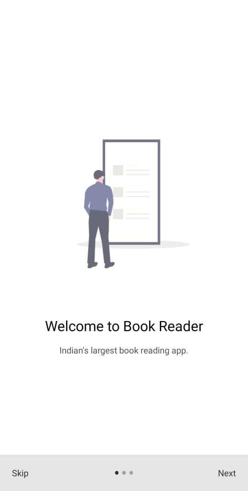
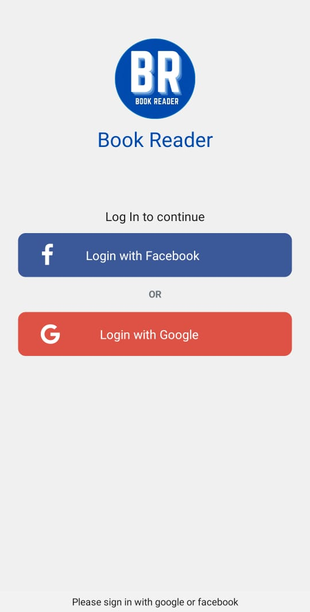
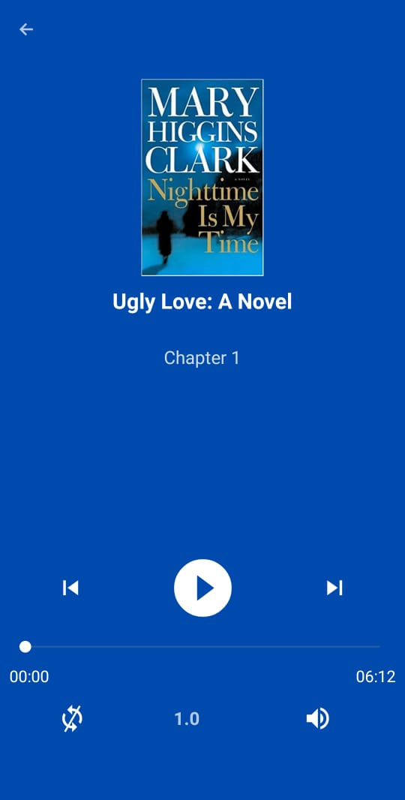
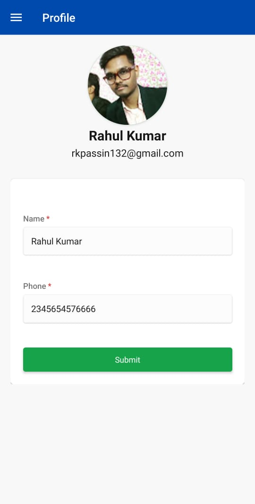
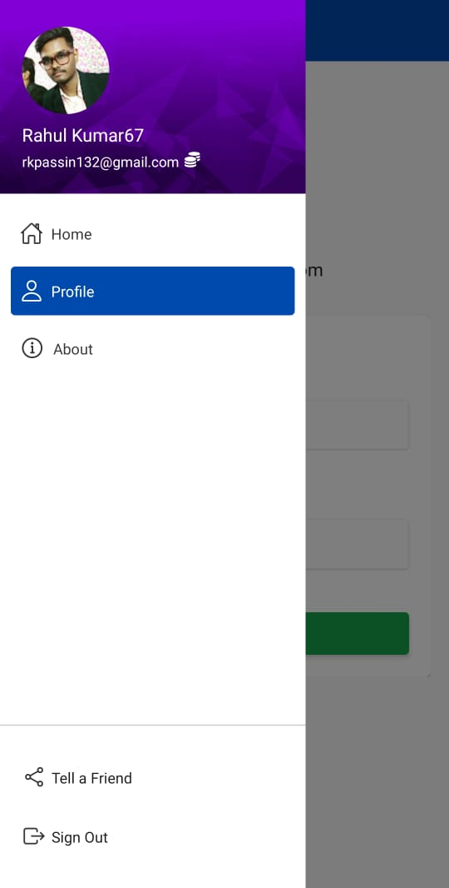

# Book Reader 

## Contents

- [Introduction](#introduction)
- [Features](#features)
- [Permissions](#permissions)
- [Compatibility](#compatibility)
- [Code at a glance](#code-at-a-glance)
  - [Frameworks](#frameworks)
  - [Libraries](#libraries)
  - [App features](#app-features)
- [System requirements](#system-requirements)
- [How to use book reader](#how-to-use-book-reader)
  - [Prepare your environment](#prepare-your-environment)
  - [Run the sample](#run-the-sample)
  - [Some other links](#some-other-links)

## Introduction


Book reader is an application where user can explore new and diffrent kind of books. User can enjoy books by reading or listening book audio.

## Feature

- Book reader an application for reading and listening book.
- You can find buy link of book at bottom of book discription. If you like any book, you can purchase it online.
- Total views, total likes of books are visible in book discription page and you can like and add to library any book.
- User can search book buy category or by book title and find diffrent kind of books.
- Add book to library in case if user wants to read this book later. This data saved online so you can check you library list in any phone.
- At home page you can find your recent readed book and recommended book for you. This app suggested you some book which suit for you, according to your interest.
- You can also check most trending book in home and explore page.
- Change you profile name and phone number.
- Login with your facebook or google account in just few simple steps.

## Permissions

On Android versions prior to Android 6.0, book reader requires the following permissions:

- Full Network Access.
- View Network Connections.
- Run at startup.
- Read and write access to external storage.

The "Run at startup" permission is only used to check newtwork. The network access permissions are made use of for downloading content. The external storage permission is used to cache article images for viewing offline.

## Compatibility:

| Android Version         |    Supported |
| :---------------------- | -----------: |
| Android 10              | Yes or Higer |
| Android 9 Pie           |          Yes |
| Android 8.0 Oreo        |          Yes |
| Android 7.0 Nougat      |          Yes |
| Android 6.0 Marshmallow |        <= No |

## Code at a glance

The table below shows the platform features used in the application and where abouts to find them in the sample.

### Frameworks

| Framework                                | Usage                  |
| :--------------------------------------- | :--------------------- |
| [React Native](https://reactnative.dev/) | For native development |

### Libraries

| Library                                                                                                | Usage                                                                                   |
| :----------------------------------------------------------------------------------------------------- | :-------------------------------------------------------------------------------------- |
| [native-base](https://docs.nativebase.io/)                                                             | Using react native ui framework                                                         |
| [@react-navigation Stack, Drawer, Tab](https://reactnavigation.org/)                                   | Creating routes of android file to navigate pages in diffrent view (stack, drawer, tab) |
| [react-native-fbsdk](https://www.npmjs.com/package/react-native-fbsdk)                                 | For facebook login                                                                      |
| [@react-native-google-signin](https://www.npmjs.com/package/@react-native-google-signin/google-signin) | For Goolge login                                                                        |
| [react-native-permissions](https://www.npmjs.com/package/react-native-permissions)                     | Getting internet and react write permission                                             |
| [react-native-video](https://www.npmjs.com/package/react-native-video)                                 | Playing audio file                                                                      |
| [react-native-vector-icons](https://www.npmjs.com/package/react-native-vector-icons)                   | Vector icons                                                                            |
| [axios](https://www.npmjs.com/package/axios)                                                           | For api calls                                                                           |
| [@react-native-community/netinfo](https://www.npmjs.com/package/@react-native-community/netinfo)       | Getting information about inetrnet staus                                                |
| [Node.js](https://nodejs.org/en/)                                                                      | Api development in node.js. [Github](https://github.com/rkpassin132/book-reader-api)    |

### App features

| Screenshots                                                             | Features                                                                     |
| :---------------------------------------------------------------------- | :--------------------------------------------------------------------------- |
| [](#)  | Splash screen check internet connection and user login credentials           |
| [](#) | If user not login This screen will appear after splash screen                |
| [](#)   | Login with facebook and goolge                                               |
| [](#)  | Book chapter audio player (pause, play, next, previous, loop, volume, speed) |
| [](#) | You can update your name and phone number                                    |
| [](#)   | Show's your photo and email id and other navigation views                    |

## How to use book reader

### Prepare your environment

This is require for development and testing

- Instal node.js, React, and react native cli in your system.
- Make sure you have Android SDk tool kit installed or Android studio installed in your system.
- On you developer option and USB debugging in you android system from setting.<br/>
  Now :-
- Start your api `npm start `
- open this url in browser for loacal host port forwarding using usb `chrome://inspect/#devices`
- open this url in browser for debug react native app `http://localhost:8081/debugger-ui/`
- adb command list to check connected device list

```
adb kill-server
adb start-server
<!-- Connect devices -->
adb devices
```

### Run the sample

- Start your react application

```
npx react-native run-android
npx react-native start
```

### Some other links

[Ionic icon](https://ionic.io/ionicons)
